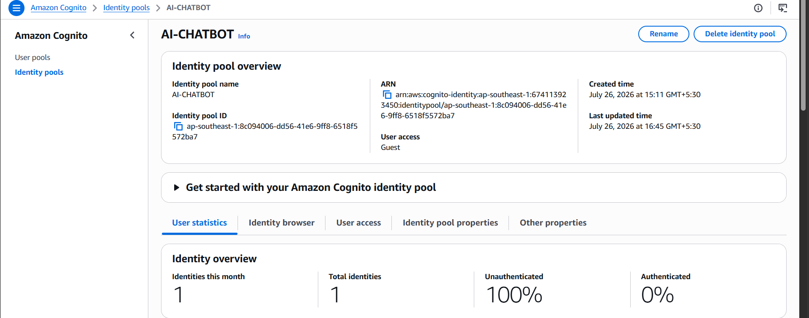
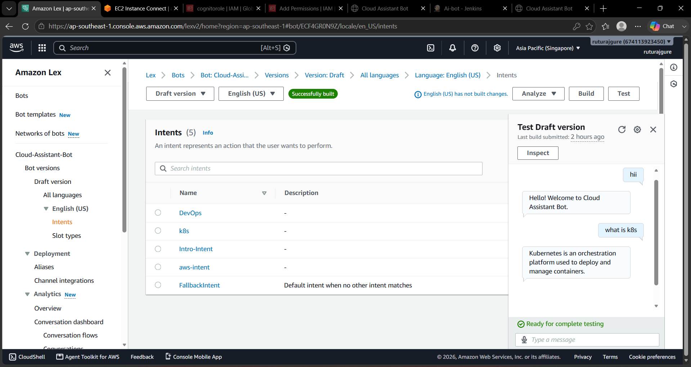
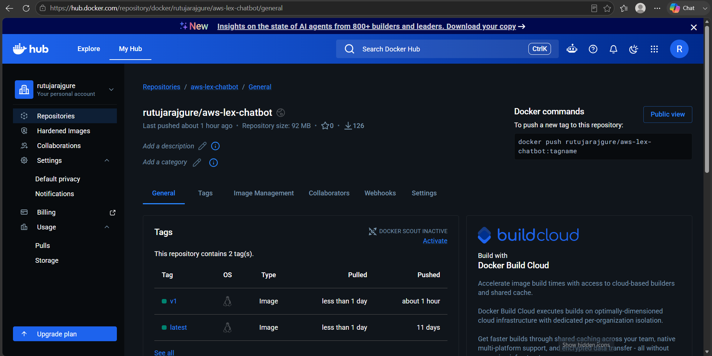
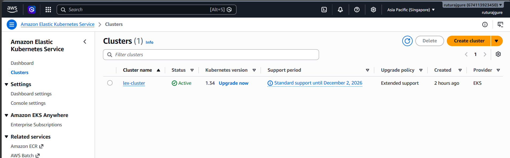
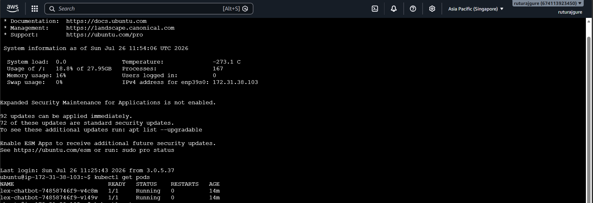
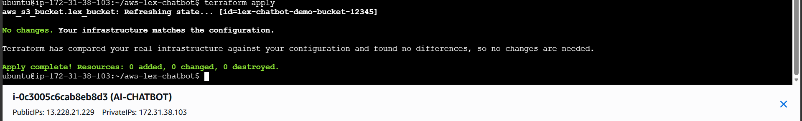
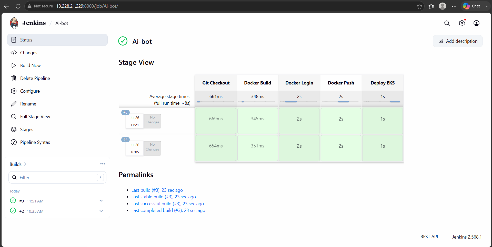

# 🤖 AWS AI Chatbot using Amazon Lex | Docker | Jenkins | Kubernetes (EKS) | Terraform

## 📌 Project Overview

This project demonstrates how to build and deploy an AI-powered chatbot using **Amazon Lex** on AWS. The chatbot understands user queries related to AWS, DevOps, and Kubernetes and responds using Amazon Lex intents.

The application is containerized using Docker, deployed to **Amazon EKS (Kubernetes)**, automated through a **Jenkins CI/CD pipeline**, and infrastructure provisioning is managed using **Terraform**.

---
## 🏗️ Application Architecture (Runtime)
```
          User
            │
            ▼
      Load Balancer URL
            │
            ▼
 Amazon EKS Service (LoadBalancer)
            │
            ▼
 Kubernetes Pods
 (NGINX + Chatbot Website)
            │
            ▼
 Amazon Cognito
            │
            ▼
 Amazon Lex Bot
            │
            ▼
 Chatbot Response
```
---

# 🛠 Technologies Used

* AWS EC2
* Amazon Lex V2
* Amazon Cognito
* Amazon EKS
* Docker
* Kubernetes
* Jenkins
* Terraform
* Git & GitHub
* HTML
* JavaScript
* AWS CLI
* kubectl
* eksctl
* CloudWatch Agent

---
# ✨ Features

* AI chatbot powered by Amazon Lex
* Authentication using Amazon Cognito Identity Pool
* Dockerized web application
* Kubernetes Deployment & Service
* Automated CI/CD using Jenkins
* Infrastructure provisioning with Terraform
* Public access through AWS Load Balancer
* Monitoring cloud infrastructure using Amazon CloudWatch Agent
* Collecting system metrics and logs
* Fully hosted on AWS Cloud
---

# 📂 Project Structure
```text
aws-lex-chatbot/
│
├── index.html
├── Dockerfile
├── deployment.yaml
├── service.yaml
├── Jenkinsfile
├── screenshots/
│   ├── AI-LEX-BOT.png
│   ├── BOT-INTENTS.png
│   ├── Cognito.png
│   └── ...
│
└── terraform/
    └── main.tf
```

---

# 📋 Prerequisites

Before starting, install:

* Git
* Docker
* AWS CLI
* kubectl
* eksctl
* Terraform
* Jenkins
* Java 21

---

# ☁ AWS Services Used

* Amazon EC2
* Amazon Lex V2
* Amazon Cognito
* Amazon EKS
* IAM
* Elastic Load Balancer
* Amazon S3 (Terraform backend/demo bucket)
* Amazon CloudWatch Agent

---

# 🤖 Amazon Lex Bot

Created the following intents:

### Greeting Intent

Training Phrases

* hello
* hi
* hey
* good morning

Response

```
Hello! Welcome to Cloud Assistant Bot. How can i help you today?
```

---

### AWS Intent

Training Phrases

* what is aws
* tell me about aws
* aws services

Response

```
AWS is Amazon Web Services, a cloud platform providing compute, storage, networking and AI services.
```

---

### Kubernetes Intent

Training Phrases

* what is kubernetes
* tell me about k8s

Response

```
Kubernetes is an orchestration platform used to deploy and manage containers.
```

---
### DevOps Intent 

Training Phrases

 * what is devops 

Response 

```
 DevOps is a set of practices, tools, and a culture that brings software development (Dev) and IT operations (Ops) together to build, test, release, and maintain software faster and more reliably. 
```

---

# 🔐 Amazon Cognito

Configured:

* Identity Pool
* Guest Access
* IAM Roles
* Lex Runtime Permissions

Used to securely connect the frontend with Amazon Lex.

---

# 🐳 Docker

Build Docker Image

```bash
docker build -t aws-lex-chatbot .
```

Run Container

```bash
docker run -d -p 80:80 aws-lex-chatbot
```

---

# ☸ Kubernetes Deployment

Deploy application

```bash
kubectl apply -f deployment.yaml
kubectl apply -f service.yaml
```

Check resources

```bash
kubectl get pods
kubectl get svc
kubectl get deployments
```

---

# ⚙ Terraform

Initialize

```bash
terraform init
```

Plan

```bash
terraform plan
```

Deploy Infrastructure

```bash
terraform apply

```
# 📊 Monitoring with Amazon CloudWatch Agent

### Install CloudWatch Agent

```bash
sudo apt update
sudo apt install amazon-cloudwatch-agent -y
```

### Verify Agent Status

```bash
sudo /opt/aws/amazon-cloudwatch-agent/bin/amazon-cloudwatch-agent-ctl -a status
```


---

# 🔄 Jenkins CI/CD Pipeline

Pipeline Stages

* Git Checkout
* Docker Build
* Docker Login
* Docker Push
* Deploy to Amazon EKS

Each GitHub commit automatically triggers the deployment pipeline.

---
# 📸 Project Screenshots

## 🤖 Amazon Lex Bot


## 🧠 Amazon Lex Intents


## 🔐 Amazon Cognito


## 🐳 Docker Images


## ☸ Amazon EKS Cluster


## 🚀 Running Kubernetes Pods


## ⚙ Terraform Resources


## 🔄 Jenkins CI/CD Pipeline


## 🌐 Load Balancer URL


## 🪣 Amazon S3 Bucket


## 💬 Chatbot Web Interface


---

# 📈 Learning Outcomes

Through this project, I gained hands-on experience in:

* Building conversational AI using Amazon Lex
* AWS Identity and Access Management
* Amazon Cognito Authentication
* Docker Containerization
* Kubernetes Deployments
* Amazon EKS
* Jenkins CI/CD Automation
* Infrastructure as Code using Terraform
* GitHub Version Control
* Collecting system metrics and logs using Amazon CloudWatch Agent
* Cloud Application Deployment

---


# 👩‍💻 Author

**Rutuja Rajgure**

GitHub: [RutujaRajgure](https://github.com/RutujaRajgure)


